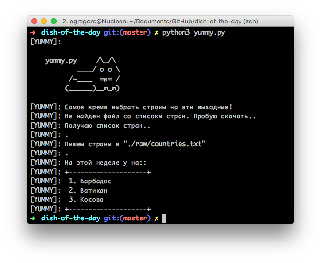

# Yummy!
Ом-ном-ном

Каждую пятницу ты можешь запускать этот скрипт, который будет показывать 
три случайные страны. А каждую субботу ты будешь готовить какое-нибудь
национальное блюды одной из выпавших стран!

## Как это работает?

В репозитории уже есть список стран, поэтому скприт не ходит в Интернет.
Но если файл со списком стран будет потеряет — то скрпит попытается его скачать.

## Требования

* Python 3 (теперь ванильный!)
* Подключение к Интернет (если нужно загрузить список стран)

## Использование

Для получения списка из 3 случайных стран
```
python3 yummy.py
```

Для обновления общего списка стран
```
python3 yummy.py update
```

## Картинки


